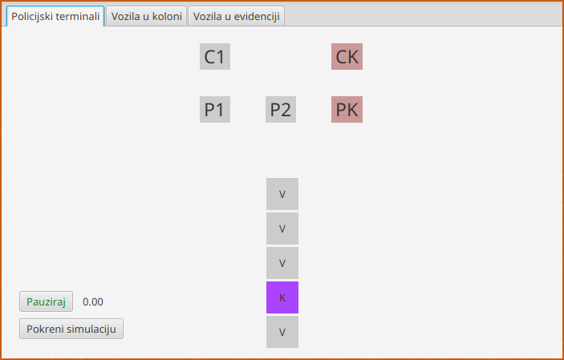
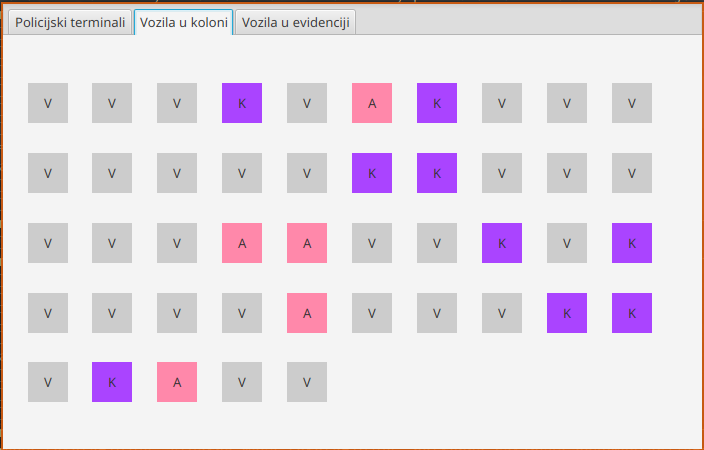
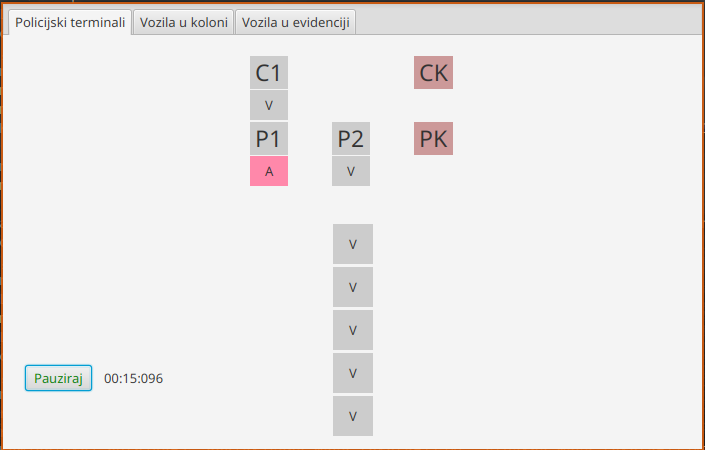
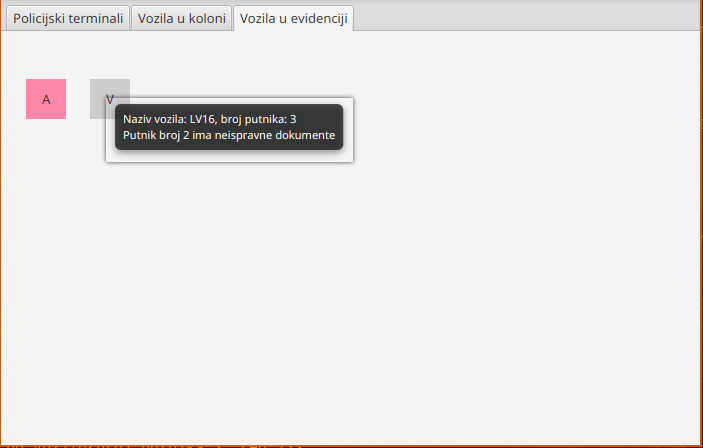

# Border Crossing

Java simulation of border crossing.

## Description

Border Crossing is a simulation that consists of 50 vehicles, which can be of types car, bus, or truck. There are 3 police terminals (2 used by cars and buses, and the 3rd one reserved for trucks) and 2 customs terminals (one for cars and buses, and the other for trucks). There is one track on which all vehicles move. The GUI has 3 tabs: _the terminals tab_, which includes terminals and the first row of cars; _the others tab_, which contains the remaining 45 cars; and the _cars with problems tab_.

As vehicles approach terminals, they go to designated terminals first to the police terminal and then to the customs terminal. Various checks are conducted on vehicles at the terminals, such as verifying if everyone has legal documents, inspecting for illegal items in bus luggage, and confirming if the weight of the truck matches the papers. If a vehicle encounters any issues during inspections, it will appear in the _cars with problems tab_. A vehicle will not be able to pass the border if the driver has invalid documents or if the weight of the truck doesn't match the specified weight in its papers.

Throughout the entire simulation, time is measured, and at any point, the simulation can be paused. On the path src/main/java/net/etfbl/output/, vehicles that had problems at the police terminal are serialized, and vehicles that had problems at the customs terminal are written to a .txt file. In the file RadTerminala.txt, specific terminals can be paused or unpaused (they are all unpaused by default). This can be done by changing 0 to 1 for the desired terminal (the order is pt1#pt2#pt3#ct1#ct2) and then saving the file.

## Screenshots

### Terminal tab

### Other cars tab

### During simulation

### Cars wiht problem tab

